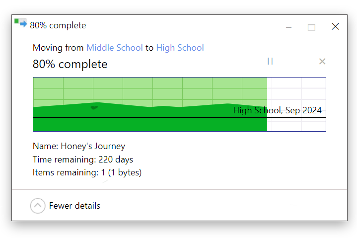
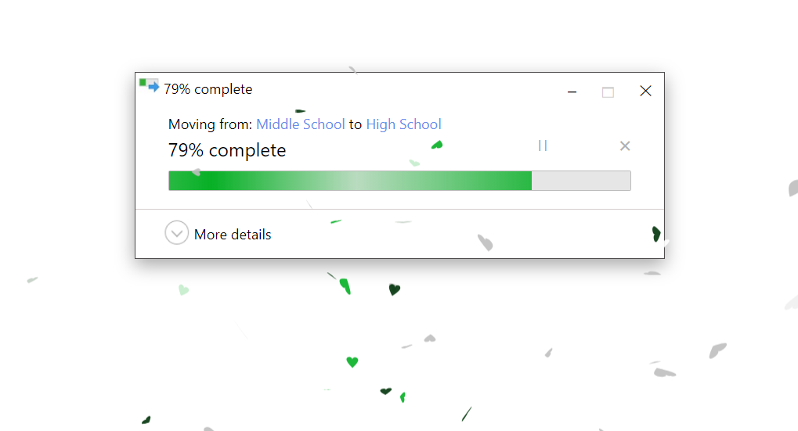

# Explorer Event Countdown
Windows Explorer now counts down the moments to your exciting event with you.
Set your own event 
countdown in 2 minutes by changing the environment variables.
###
[Demo](https://react-cool-explorer-countdown.vercel.app/).
###
Preview:  

# Setup
1. Set environment varaibles  
--> Create .env file in the root folder  
--> Add the below environment variables:  
     REACT_APP_EVENT_DATE= `<`Event Date`>`  
        Example: '2024/09/01'  
     REACT_APP_STARTING_DATE= `<`Date count down was started`>`   
        Example: '2021/09/01'  
     REACT_APP_EVENT_SOURCE=`<`Source`>`  
         (String)  
         Example: 'Middle School'  
     REACT_APP_EVENT_TARGET=`<`Target`>`  
         (String) Example: 'High School'  
     REACT_APP_BRAND_NAME=`<`Description about the countdown`>`   
         (String)  
          Example: "Honey's Journey"  
     REACT_APP_EVENT_CONGRATS=`<`Slogan or congrat that will be animated on the countdown`>`  
         (String)  
          Example: "High School, Sep 2024"  
     REACT_APP_LOCALE=`<`Language`>`  
          Default: en (English).  
          Set it to 'he' to get your coutdown in Hebrew. (Currently only English and Hebrew were developed, but you can   easily add more languages in Translation folder)  
2. Run npm install  
3. Run npm start  
    YOU ARE DONE!!  
##
This project was bootstrapped with [Create React App](https://github.com/facebook/create-react-app).
